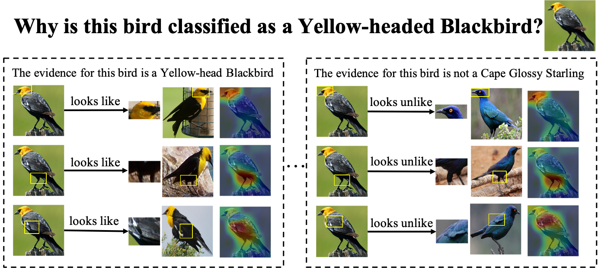
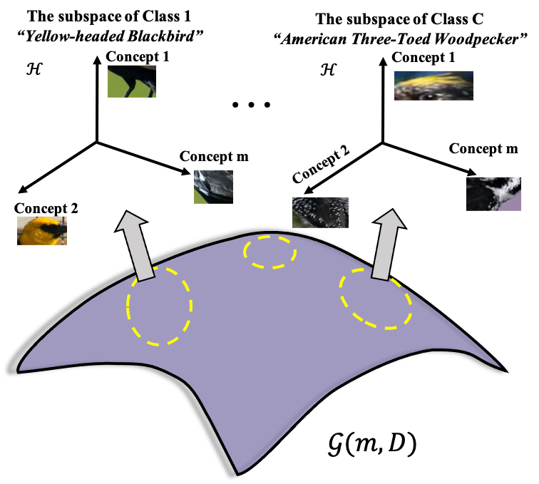

# TesNet: Interpretable Image Recognition by Constructing Transparent Embedding Space

This repository presents the code for the paper "[Interpretable Image Recognition by Constructing Transparent Embedding Space](https://openaccess.thecvf.com/content/ICCV2021/papers/Wang_Interpretable_Image_Recognition_by_Constructing_Transparent_Embedding_Space_ICCV_2021_paper.pdf)" , which was published at ICCV 2021.

Considering the examples above, how would you identify the bird image as a *Yellow-headed Blackbird* and not a *Cape Glossy Starling*? Maybe you find that the bird's head, legs, and feathers look like those concepts of *Yellow-headed Blackbird* rather than *Cape Glossy Starling*. In other words, you may gather the evidence in your mind and make a final decision. Specifically, humans usually explain their reasoning process by dissecting the image into object parts and pointing out the evidence from these identified parts to the concepts stored in his / her mind. Therefore, for the intelligent machine, it is an emergent issue to determine the object parts and construct the concepts in order to implement interpretable image classification.

>**Interpretable Image Recognition by Constructing Transparent Embedding Space**
>
>Jiaqi Wang, Huafeng Liu, Xinyue Wang, Liping Jing
>
>*IEEE/CVF International Conference on Computer Vision (ICCV), 2021*

**Abstract:** Humans usually explain their reasoning (e.g. classification) by dissecting the image and pointing out the evidence from these parts to the concepts in their minds. Inspired by this cognitive process, several part-level interpretable neural network architectures have been proposed to explain the predictions. However, they suffer from the complex data structure and confusing the effect of the individual part to output category. In this work, an interpretable image recognition deep network is designed by introducing a plug-in transparent embedding space (TesNet) to bridge the high-level input patches (e.g. CNN feature maps) and the output categories. This plug-in embedding space is spanned by transparent basis concepts which are constructed on the Grassmann manifold. These basis concepts are enforced to be category-aware and within-category concepts are orthogonal to each other, which makes sure the embedding space is disentangled. Meanwhile, each basis concept can be traced back to the particular image patches, thus they are transparent and friendly to explain the reasoning process. By comparing with state-of-the-art interpretable methods, TesNet is much more beneficial to classification tasks, esp. providing better interpretability on predictions and improve the final accuracy.

This version of code package was based on ProtoPNet (https://github.com/cfchen-duke/ProtoPNet)

## Getting Started

**Requirements:** Pytorch, Numpy, cv2, Augmentor

Take the CUB-200-2011 as an example.

### Preprocess the datasets

1. Download the datasets from the following two links

- CUB-200-2011 can be downloaded from:
  http://www.vision.caltech.edu/visipedia/CUB-200-2011.html

- Stanford Cars can be downloaded from:
  https://ai.stanford.edu/~jkrause/cars/car_dataset.html

2. Crop the images and split the cropped images  by `./preprocess_data/cropimages.py`

- The cropped training images in the directory: `./datasets/cub200_cropped/train_cropped/`

- The cropped test images in the directory: `./datasets/cub200_cropped/test_cropped/`

3. Augment the training set by `./preprocess_data/img_aug.py`

- The augmented training set in the directory: `./datasets/cub200_cropped/train_cropped_augmented/`

### Train the model

1. Provide a correct path for `data_path, train_dir, test_dir, train_push_dir` in `settings_CUB.py`
2. Run `python main.py`

### Reasoning process

Run `local_analysis.py` 

